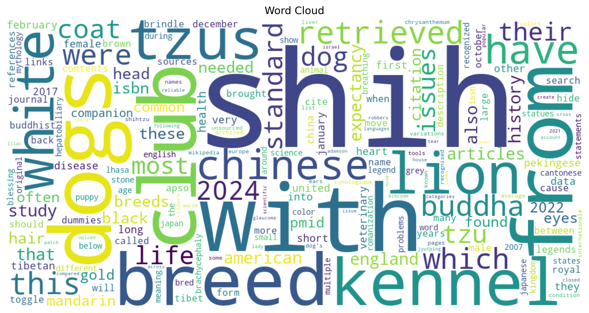

# nlp-01-getting-started
Alissa Beaderstadt - Web Mining and Applied NLP

Graduate Student - Data Analytics

This repository contains my custom work for the course starter project. The notebook explores text pulled from a webpage and performs a basic NLP word frequency analysis.

I first ran the provided example notebook and then copied it to create my own version where I experimented with modifications and analysis.

Starter file: web_words_case.ipynb
Custom file: web_words_beaderstadt.ipynb


[](#)
[](./LICENSE)

> Professional Python project for Web Mining and Applied NLP.

Web Mining and Applied NLP focus on retrieving, processing, and analyzing text from the web and other digital sources.
This course builds those capabilities through working projects.

In the age of generative AI, durable skills are grounded in real work:
setting up a professional environment,
reading and running code,
understanding the logic,
and pushing work to a shared repository.
Each project follows a similar structure based on professional Python projects.
These projects are **hands-on textbooks** for learning Web Mining and Applied NLP.

## This Project

This is the **getting started** project.
The goal is to copy this repository, set up your environment, run the example script and notebook, and push your work to GitHub.
Then, you'll change the authorship to make the project yours and explore the structure.
No major code changes are required.

You'll work with just these areas:

- **notebooks/** - Jupyter notebooks for exploration
- **src/nlp/** - Python code (verifies .venv/)
- **pyproject.toml** - update authorship, links, and dependencies
- **zensical.toml** - update authorship and links

The goal is just to confirm you can run projects on your machine.
Once you get the first project running successfully,
the rest of the course is much easier.

## First: Follow These Instructions

Follow the [step-by-step workflow guide](https://denisecase.github.io/pro-analytics-02/workflow-b-apply-example-project/) to complete:

1. Phase 1. **Start & Run**
2. Phase 2. **Change Authorship**
3. Phase 3. **Read & Understand**

## Challenges

Challenges are expected.
Sometimes instructions may not quite match your operating system.
When issues occur, share screenshots, error messages, and details about what you tried.
Working through issues is an important part of implementing professional projects.

## Success

After completing Phase 1. **Start & Run**, you'll have your own GitHub project,
running on your machine, and running the example will print out:

```shell
========================
Pipeline executed successfully!
========================
```

And a new file named `project.log` will appear in the project folder.

Once you see it, you're 90% of the way there.
After that, you'll just make the project yours and get started exploring.

## Command Reference

The commands below are used in the workflow guide above.
They are provided here for convenience.

Follow the guide for the **full instructions**.

<details>
<summary>Show command reference</summary>

### In a machine terminal (open in your `Repos` folder)

After you get a copy of this repo in your own GitHub account,
open a machine terminal in your `Repos` folder:

```shell
git clone https://github.com/abeaderstadt/nlp-01-getting-started
cd nlp-01-getting-started
code .
```

### In a VS Code terminal

```shell
uv self update
uv python pin 3.14
uv sync --extra dev --extra docs --upgrade

uvx pre-commit install
git add -A
uvx pre-commit run --all-files

# Later, we install spacy data model and
# en_core_web_sm = english, core, web, small
# It's big: spacy+data ~200+ MB w/ model installed
#           ~350–450 MB for .venv is normal for NLP
# uv run python -m spacy download en_core_web_sm

# First, run the module
# IMPORTANT: Close each figure after viewing so execution continues
uv run python -m nlp.web_words_case

# Then, open the notebook.
# IMPORTANT: Select the kernel and Run All:
# notebooks/web_words_case.ipynb

uv run ruff format .
uv run ruff check . --fix
uv run zensical build

git add -A
git commit -m "update"
git push -u origin main
```

</details>

## Notes

- Use the **UP ARROW** and **DOWN ARROW** in the terminal to scroll through past commands.
- Use `CTRL+f` to find (and replace) text within a file.

## My Project Modifications

To make this project my own, I made several small modifications to the example notebook.

First, I changed the input webpage from the original example site to the Wikipedia page for the Shih Tzu dog breed. This allows the analysis to run on a different dataset and produces results based on the Shih Tzu article text.

I also removed entire sections of the HTML that correspond to navigation, headers, and other UI elements before extracting the text with BeautifulSoup.

Next, I modified the text cleaning step by adding logic to remove hyphens during cleaning and filtering out common navigation words that were still present, such as "main", "menu", and "sidebar", to reduce noise in the dataset.

I added a quick data check by printing the total number of raw words and the total number of cleaned words to verify how much text is removed.

To make the output easier to interpret, I adjusted the notebook to print the first 10 words instead of 20 when previewing the text. I also increased the number of words displayed in the bar chart of most frequent terms from 10 to 15 so more common terms from the article can be observed.

After running the notebook with these changes, the frequency table, bar chart, and word cloud now reflect the vocabulary from the Shih Tzu Wikipedia article instead of the original example site.


## Example Artifact (Output)


